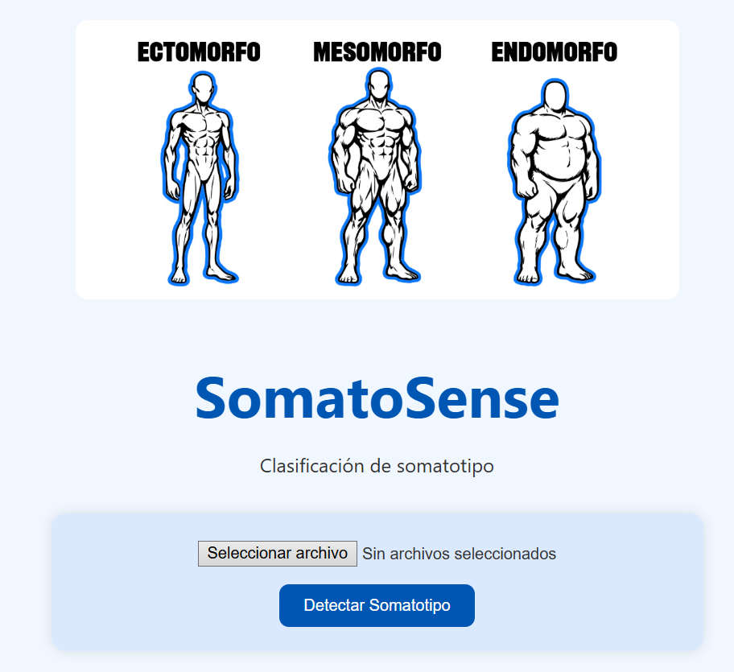
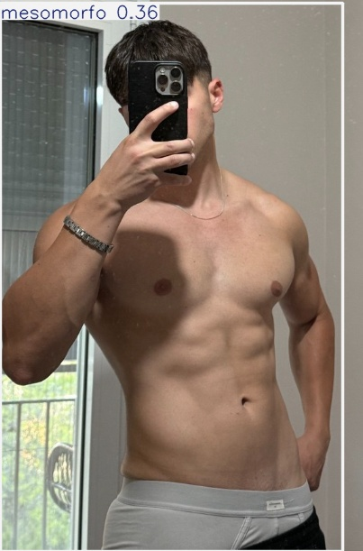
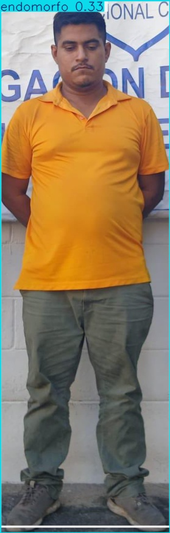
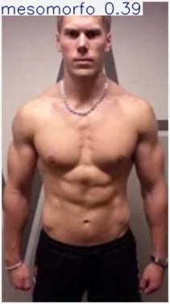
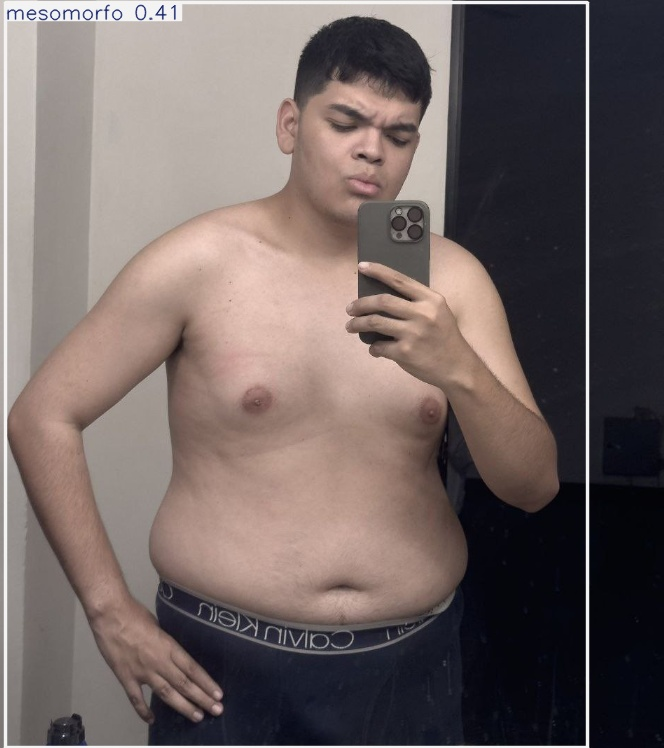
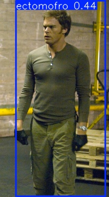
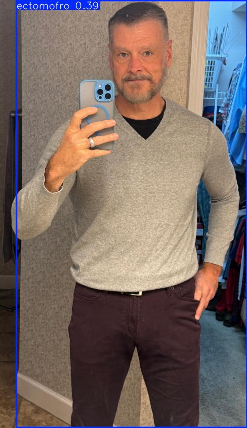

# 🧬 SomatoSense

**SomatoSense** es una aplicación web basada en visión artificial que clasifica el **somatotipo corporal humano** usando un modelo entrenado con **YOLOv8**.
El sistema identifica automáticamente si una persona pertenece a uno de los tres tipos somáticos:

* **Ectomorfo**
* **Mesomorfo**
* **Endomorfo**

Ideal para proyectos de IA, análisis corporal, fitness, salud y estudios deportivos.

---

## 📸 Interfaz principal



---

## 🧠 ¿Qué es SomatoSense?

SomatoSense analiza imágenes o cámara en vivo para determinar el tipo corporal predominante usando detección automática y clasificación profunda.

✔️ Subes una imagen
✔️ El modelo analiza las proporciones corporales
✔️ Te devuelve el somatotipo con su porcentaje de confianza
✔️ También puedes activar la cámara para detección en tiempo real

---

## 🧍‍♂️ Tipos de somatotipos detectados

### **🔵 Ectomorfo**

* Cuerpo delgado
* Hombros estrechos
* Menor masa muscular

### **🟢 Mesomorfo**

* Cuerpo atlético
* Hombros anchos
* Buena musculatura

### **🔴 Endomorfo**

* Cuerpo ancho
* Mayor acumulación de grasa
* Hombros y cadera más amplios

Las detecciones se muestran visualmente en el sistema con cajas, colores y porcentajes de confianza.

---

## 📸 Resultados de ejemplo





...



...



...



...



...


---

## 🚀 ¿Cómo ejecutar SomatoSense?

### 1️⃣ Clona el repositorio

```bash
[git clone https://github.com/GabrielElBorre/SomatoSense.git]
cd SomatoSense
```

### 2️⃣ Crea un entorno virtual

```bash
python -m venv venv
venv\Scripts\activate
```

### 3️⃣ Instala dependencias

```bash
pip install -r requirements.txt
```

### 4️⃣ Ejecuta la app

```bash
python app.py
```

### 5️⃣ Abre el navegador

```
http://localhost:5000
```

---

## 🛠️ Tecnologías utilizadas

* 🐍 **Python 3.12**
* 🌐 **Flask**
* 🤖 **YOLOv8 – Ultralytics**
* 🎥 **OpenCV**
* 🎨 **HTML5 + CSS3**
* 🔧 **JavaScript**

---

## 👨‍💻 Desarrollado por

* **Gabriel Gerardo Cardenas Briones**
* **Branna Denisse Medrano Castillo**

---

## ✨ Funciones futuras

* 🌍 **Versión web hospedada en la nube** (Render / Railway / VPS)
* 📱 **Interfaz móvil totalmente responsiva**
* ♀️ **Dataset Mas Completo incluyendo el genero femenino** por detecciones específicas
* 🔐 **Sistema de autenticación** para proteger la vista en vivo
* 🖼️ **Más clases de somatotipos y características corporales**

**Aviso legal sobre el uso de imágenes**

Las imágenes utilizadas en este proyecto provienen únicamente de redes sociales y plataformas públicas (TikTok, Pinterest, Instagram, X/Twitter, Facebook y Grok).
Estas imágenes se emplearon exclusivamente para fines educativos, demostrativos y de investigación académica, sin intención de lucro.

No se reclama propiedad sobre dichas imágenes.
Todos los derechos pertenecen a sus respectivos autores y plataformas de origen.

Si algún autor desea que su contenido sea retirado, puede solicitarlo y será eliminado de inmediato.

Uso justo académico (Fair Use)

El dataset creado para entrenar el modelo de clasificación de somatotipos se utilizó bajo el principio de uso justo educativo.
Las imágenes:

• No se distribuyen públicamente.
• No se monetizan.
• No permiten identificar a personas de forma explícita.
• Se emplean únicamente con propósitos de aprendizaje y análisis 
algorítmico.

Este proyecto no almacena información personal ni busca representar a personas reales, sino ejemplificar el comportamiento del modelo de visión computacional.


